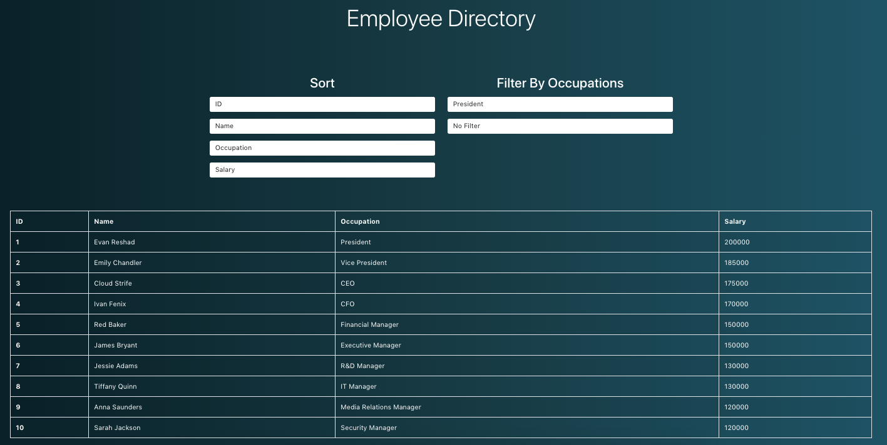

# Employee Directory

## Table of Contents
* [Author(s)](#author(s))
* [Description](#description)
* [Technologies Used](#technologies-used)
* [Installation](#installation)
* [Usage](#usage)
* [Contributing](#contributing)
* [Deployment Application Link](#deployment-application-link)
* [Application in Use](#application-in-use)

## Author(s)
Joey Bruno, Tyler Kennedy, Brandon Cansler

## Description
This is an employee directory where you are able to see a list of employees and sort them by their given ID, their name, their occupation, and their salary. 

## Technologies Used
* React

## Installation
To install this application you clone the SSH Key from the main hub page of this repository and you paste that clone link into your Terminal with git clone.

## Usage
To use this application you go to the deployed link available within this README file and press each individual button to organize between the given options.

## Contributing
To contribute, clone this repository into your terminal, work on the project, then create a pull request.

## Deployment Application Link
[Deployed Employee Directory Application](https://brunojoey.github.io/user-directory-build/)

## Application in Use
